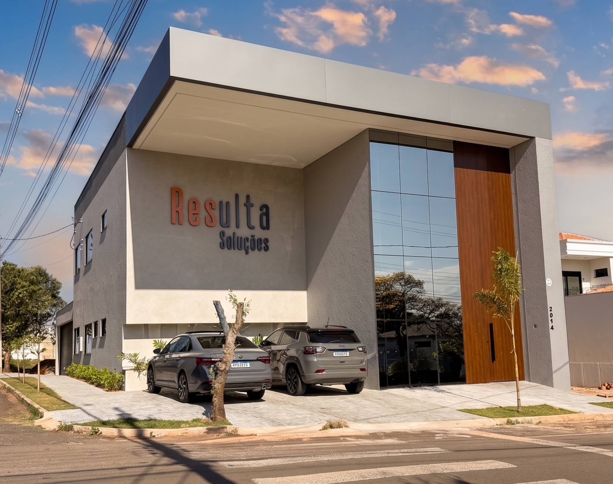

<h1>Somos a Resulta Soluções.</h1>

Sede - Umuarama

---

Somos uma empresa com mais de 25 anos no mercado fundada pelo nosso gestor geral “Ricardo Struckel Neto” em 18/08/1999 atuante no mercado Contábil e Advocatório desde então, crescendo cada dia mais juntos como família/time para melhor atender nossos clientes/parceiros.
  
Os administradores da empresa hoje são todos familiares sendo “Ricardo Struckel Neto” o gestor geral junto com “Thatiane Struckel” e “Ricardo Struckel Junior”.
  
Queremos que esta nossa parceria dure muitos anos e que seja boa para ambas as partes, o que precisar de nós como empresa/time pode contar conosco.
  
Atuando desde 1998 em parceria com as Soluções Domínio, a Resulta Soluções atende Empresas de Contabilidade e Advocacia, Instituições de Ensino e Órgão Público em toda a região Oeste do Estado do Paraná, com unidades de negócio nas cidades de Cascavel, Pato Branco e Umuarama. Com uma equipe especializada, fornecemos serviços de consultoria, treinamento presencial e à distância, implantações assistidas e na unidade realizamos cerca de 5.000 atendimentos mensais.   

O foco do sistema é atender escritórios de contabilidade e empresas que fazem contabilidade interna, atendendo principalmente a rotina de:

&#10004; <b style="color: #e65124 !important;">Cálculo da Folha de Pagamento</b>

&#10004; <b>Escrituração Fiscal</b>

&#10004; <b>Contabilidade Fiscal</b>

Hoje a empresa temos 3 unidades sendo elas em:

  Pato Branco
  Cascavel
  Umuarama

